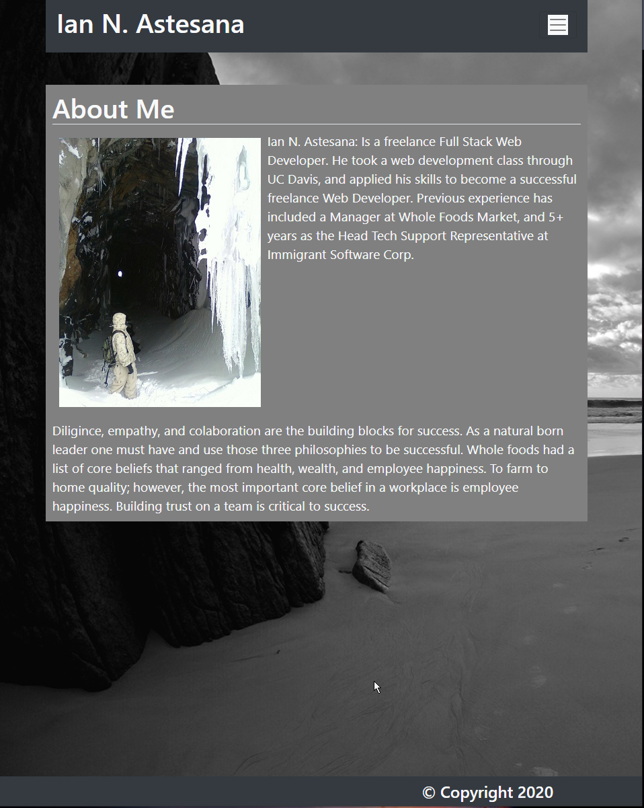

# My Portfolio

### I added to my original project, by adding a resume section. It is linked in the header, and also in the portfolio section of my project.

## HTML

### I added links to my resume, and made a resume page. Showcasing my successes, employment history, interests, and current pictures, and links to social media. 

#### Homepage
The homepage is a quick summary about me, and showcasing my work. I made the homepage from "scratch" and it is all my own work, design, layout and theme.

#### Portfolio Page
My portfolio page is the meat of this project. It showcases what I have done, and some of the work that I am most proud of, including links to each of the projects showcased.

#### Contact Page
This contact page needs a little bit more work. I need to actually get it to send and e-mail when hitting send. I have not yet took the time to learn how to do that.
    
## CSS

The styling that I added to this page was mostly hover effect. I spent the most time trying to figure out how to make things "POP".

   

https://greezon.github.io/upgraded-bioproject/index.html

## Contributing
Pull requests are welcome. I will not be reviewing any changes from any unknown source.

## License
[MIT](https://choosealicense.com/licenses/mit/)

